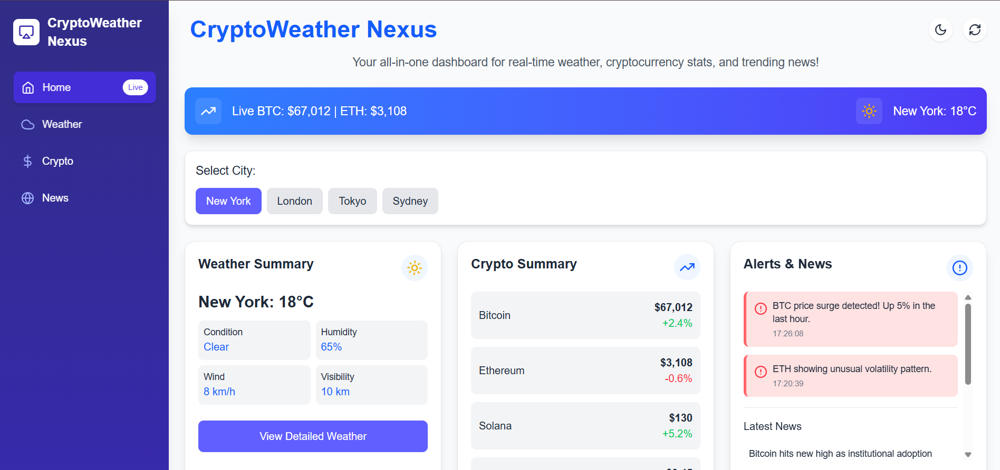
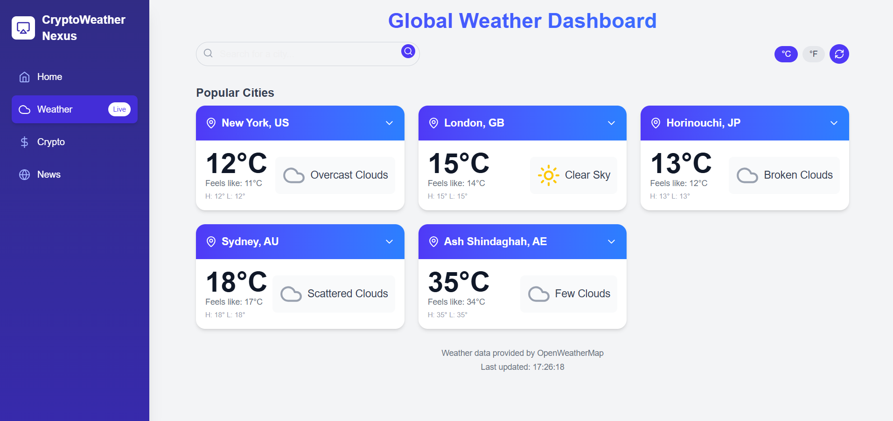
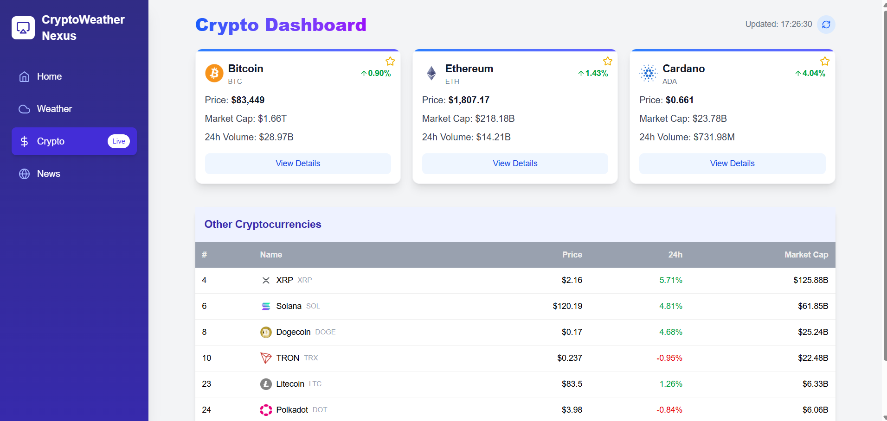
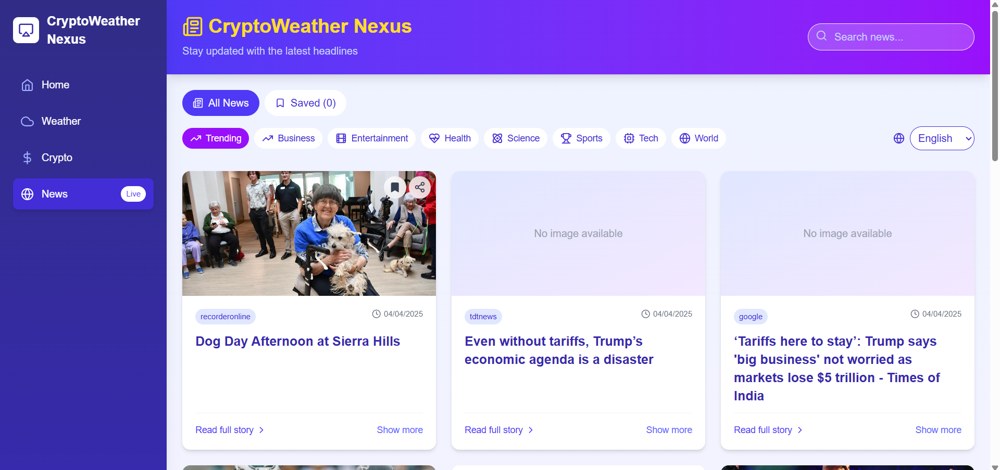

# CryptoWeather Nexus

CryptoWeather Nexus is a dynamic web application that provides real-time updates on weather, cryptocurrency, and news. The homepage displays live weather and crypto data along with the latest news headlines. The Weather page offers detailed weather information for four selected locations. The Crypto page showcases 24-hour cryptocurrency data with visual insights. The News page delivers the latest updates across various categories with powerful filtering options for a personalized experience.

## 🚀 https://crypto-weather-nexus-qikuwq9c4-mounya519s-projects.vercel.app/

## 🖼️ Screenshots

## Home page

## whether page

## crypto currency page

## news page



## 🛠️ Tech Stack

- Frontend:Next.js, tailwind adn framer motion
- Backend: third party apis

## 📦 Installation

```bash
# Clone the repository
https://github.com/mounya519/CryptoWeatherNexus.git

# Navigate to the project directory
cd my-next app
# Install dependencies
npm install

# Start the server
npm run dev
